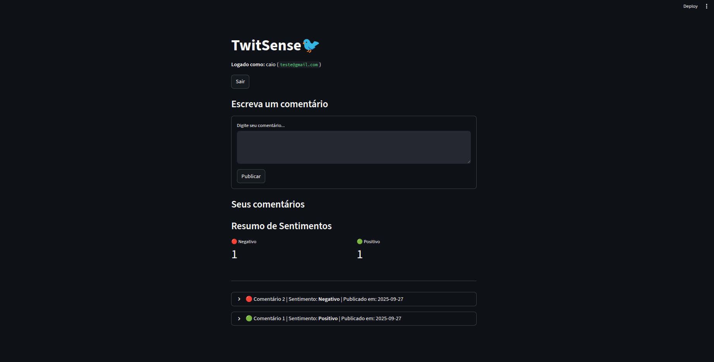
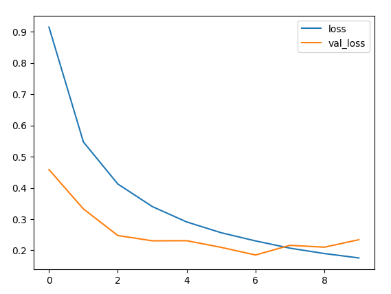
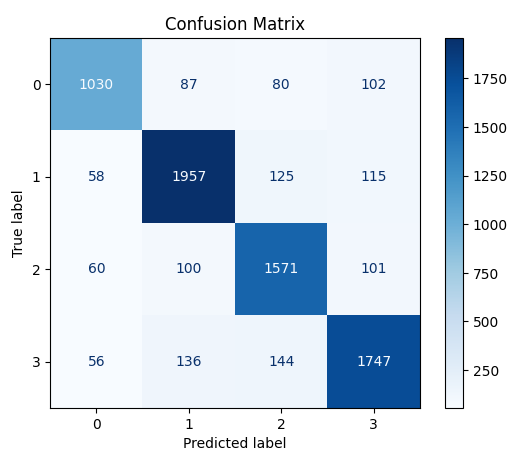
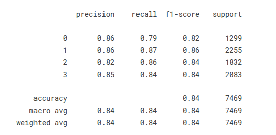

# 🐦 TwitSense

| Plataforma |
| :--- | 
|  |  


## Gerenciador de Comentários com Análise de Sentimento em Tempo Real

[](https://www.python.org/)
[](https://streamlit.io/)
[](https://supabase.io/)
[](https://www.postgresql.org/)

---

## 💡 Sobre o Projeto

Este é um sistema robusto de **gerenciamento de comentários** construído com **Streamlit**, **Python** e **Supabase**. Ele não é apenas um CRUD (Create, Read, Update, Delete), mas um sistema inteligente focado em insights imediatos.

O grande diferencial é a integração de um modelo de **Análise de Sentimento** em tempo real. Toda vez que um comentário é publicado ou editado, ele é classificado automaticamente, fornecendo feedback visual instantâneo ao usuário.

Experimento ocumentado na plataforma Kaggle com o seguinte link: [https://www.kaggle.com/code/palaciodata/classification-sentiment](https://www.kaggle.com/code/palaciodata/classification-sentiment)  
Dados utilizados open-source da plataforma: [https://www.kaggle.com/datasets/jp797498e/twitter-entity-sentiment-analysis](https://www.kaggle.com/datasets/jp797498e/twitter-entity-sentiment-analysis)  
Você ira encontrar o modelo na pasta model juntamente com o tokenizador utilizado durante o treinamento

---

### Métricas de Treinamento

| Métrica | Visualização |
| :--- | :--- |
| Perda (Loss) durante o Treinamento |  |
| Matriz de Confusão |  |
| Precisão por Classe |  |

### Funcionalidades em Destaque:

* **Análise de Sentimento em Tempo Real:** Classificação instantânea (`positivo`, `negativo`, `neutro`, `irrelevante`) usando modelo LSTM(Long shot memory).
* **Resumo de Sentimentos (Dashboard):** Exibição de métricas visuais que totalizam os comentários por cada categoria de sentimento.
* **Visualização Clara:** Cada comentário na lista é marcado com uma bolinha colorida:
    * **🟢 Positivo**
    * **🔴 Negativo**
    * **🟡 Neutro**
    * **⚪ Irrelevante**
* **Gerenciamento Completo:** Publicação, listagem, edição e exclusão de comentários.

---

## 🛠️ Tecnologias Utilizadas

| Componente | Tecnologia | Propósito |
| :--- | :--- | :--- |
| **Interface (UI)** | **Streamlit** | Criação rápida e interativa do front-end. |
| **Backend/Lógica** | **Python** | Regras de negócio e chamada ao modelo de IA. |
| **Banco de Dados** | **Supabase (PostgreSQL)** | Persistência de dados e execução de funções. |
| **Análise de Sentimento** | Modelo LSTM | Classificação de texto. |

---


```bash
git clone [https://www.youtube.com/shorts/apr341idq8U](https://www.youtube.com/shorts/apr341idq8U)
cd [NOME DO SEU PROJETO]
